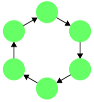
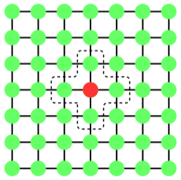

[<< Infrastructure](../../infrastructure/)    
[<< CM1-GACluster](index)

## Overview

This method is based on a Genetic Algorithm implementation. Its evolutionary approach aims at
clusterizing the set of items (i.e. digital currencies) into a number of clusters based on their price evolution in time. A key feature of the method is to filter the items with similar trajectories over time (included in clusters).

## Data

The default service runs on historical price data from the same period of time for all analyzed digital currencies.

## Algorithm
Prerequisites:
* Let S be the set of initial items of size NS
* Let NC be the number of generated clusters
* Let t be a time interval on which deviation is considered

The algorithm performs the following steps:  
1. Randomly select NC items from the initial items set S. These will represent the individuals of the initial population;
2. For each moment in time, calculate the maximum deviation allowed as an average value of distances between all items;
3. Check the fitness of each item by comparing the deviation calculated at step 2 with the modulus of difference between item’s price in time t and individual’s value in time t, for each cluster;
4. Allocate the items to one of the clusters, based on the biggest fitness;
5. Stage of evolution. At this step, the individuals should evolve. New individuals will be determined by calculating the average distance between each cluster’s items, resulting a new individual for each cluster.
6. Check if the individuals may evolve anymore, if yes, repeat the proccess starting with step 3. Splitting up the set of items, based on average distances, there will be a moment when the items will stop moving from one cluster to another. At this moment the process ends and the clusters are delivered.

## Performance

### Implementation approaches

#### 1. MapReduce

#### 2. Isles

